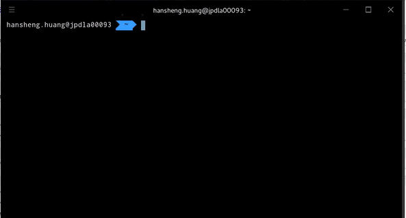

# HyperPreview

[](LICENSE.md)
[](https://github.com/zenixls2/hyperpreview/issues)

> URI preview for [Hyper](https://hpyer.is). <br>
Display the preview of links in console that your mouse hovers on.



## Installation
Since this plugin is still not available in npm, we have to do manual installation.  
Simply clone this repo inside `~/.hyper_plugins/local/` and modify `~/.hyper.js`:
```js
module.exports = {
  ...
  localPlugins: ["hyperpreview"],
  ...
};
```

## Credits

This plugin is inspired by [`xterm.js`](https://github.com/xtermjs/xterm.js) for how it calculates the mouseover,
and [`xterm-addon-web-links`](https://github.com/xtermjs/xterm-addon-web-links) for how it parses weblinks.

---

Made with :sparkles: & :heart: by [zenixls2](https://github.com/zenixls2) and [contributors](https://github.com/zenixls2/hyperpreview/graphs/contributors)
